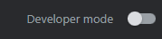
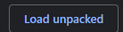

# BirdX
- Change the home "X" logo back to the Twitter bird logo.

# How To Install (Chromium-Based Browsers)
- Chrome, Edge, Opera, etc
1. Install the latest version
2. open `chrome://extensions`

3. Now press `load upacked`

4. Now choose the `BirdX` folder

Installing it on Firefox is relatively similar.